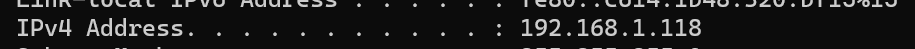

Note:
dalam website ini terdapat fitur vr pada halaman product.html, sehingga memerlukan beberapa kriteria untuk dapat menjalankannya.
Pastikan:

1. Menggunakan HP Android
2. Versi Google Chrome 83+
3. Menginstal Google Lens
4. Perangkat mendukung Google Play Service for AR (dapat di cek melalui https://play.google.com/store/apps/details?id=com.google.ar.core )

Cara menjalankan AR

- melalui source code

1. siapkan extensi live server (https://marketplace.visualstudio.com/items?itemName=ritwickdey.LiveServer)
2. jalankan extensi live server pada source code
3. pastikan jaringan wifi yang digunakan antara HP dan PC yang digunakan adalah jaringan wifi yang sama.
4. buka CMD dan jalankan ipconfig
   
5. copy ip address PC anda ke browser google chrome di Hp yang ingin digunakan lalu dibelakangnya ditambah port live server yang sedang berjalan.
   contoh: -ip live server: http://127.0.0.1:5501/
   -ip yang ada di hp: http://192.168.1.118:5501/
6. lalu menuju ke file product.html dan pencet tombol show in your room. 

- melalui link
https://wdc-ecommerce.vercel.app/product.html 
